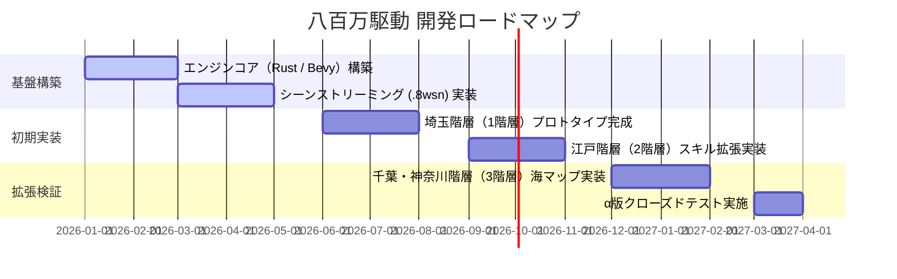

## 5. 追加機能・拡張システム案

### ① 経済・流通システム（宿場町トレード）
| レイヤー | 主な流通品 | 役割 |
| :--- | :--- | :--- |
| **初期階層**（埼玉など） | 根菜、ブランド肉、淡水魚、木材 | 基礎素材の安定供給 |
| **都市階層**（江戸など） | 加工品、武器防具、書物、娯楽品 | 上位クラフト・スキル拡張の拠点 |
| **海洋階層**（千葉・神奈川）| 塩、魚介類、真珠、航海用ロープ | 料理バフの強化、特殊装備の素材 |

### ② 旅籠・宿屋ネットワーク（ファストトラベル）
* **仕組み:** 各階層の宿場町にある「旅籠（はたご）」にチェックイン（銭を支払い宿泊）することで、次回の移動時にロードを短縮したファストトラベルが可能となる。
* **ペナルティ・演出:** 馬車や駕籠（かご）に乗る移動モーションが挟まり、世界観を壊さない没入感を維持する。

### ③ 天候・季節サイクルシステム
* **四季の影響:** リアルタイム連動またはゲーム内時間で春夏秋冬が巡り、採取できる植物や出現するエネミーが変化する。
* **異常気象:** 「大雪」や「台風」などの気象条件が発生すると、移動速度低下や特定属性のボーナスが付与される。

---

## 6. ネットワーク・同期アーキテクチャ（マルチプレイ仕様）

### ① エリア分割とサーバー構成
* **ステート管理:** 各都道府県階層（インスタンス）ごとに独立した専用Rustサーバープロセスを割り当て、メモリ肥大化とラグを防止。
* **クライアント・サーバー間通信:** UDPベースの独自軽量プロトコルを採用し、Voxelの破壊・設置情報をリアルタイムかつ低負荷で同期。

### ② クロスプラットフォーム・入力制限
* **対象環境:** Windows 11 専用最適化により、描画スレッドおよび物理演算のスレッドアフィニティを固定化し、安定したフレームレートを維持。
* **入力デバイス:** キーボード＋マウス操作を基本としつつ、コントローラー（ゲームパッド）のネイティブマッピングを標準サポート。

---

## 7. 今後のロードマップと実装マイルストーン

📏 開発段階に応じたマップサイズの目安
 | 段階 | サイズイメージ | ブロック数 (1m=1ブロック)目的・用途 | 
 | :--- | :--- | :--- |
 | ① 動作テスト用（今ココ！） | 10m × 10m 〜 20m × 20m | 10×10 〜 20×20キャラが落ちずに走れるか、ジャンプできるかの検証 | 
 | ② ミニ試作（タウン・村） | 50m × 50m | 50×50 | 家が数軒、木や宝箱、NPCが数人置ける程度の広さ | 
 | ③ 本番（1エリア/埼玉など） | 100m × 100m 〜 (分割読み込み) | 100×100 以上 | 宿場町やフィールド、ダンジョンなどの広大な世界|
